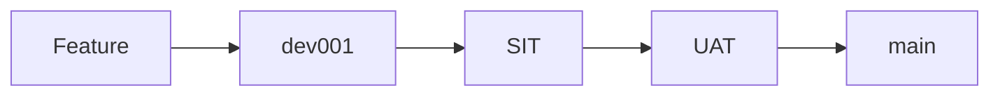

# DocFlow4 Version Control & Deployment Strategy

## Overview
This document outlines the comprehensive version control, branching, deployment, and testing strategy for the DocFlow4 application using AWS Amplify multi-environment architecture.

## Current Environment Mapping

### Branch → Environment Mapping
```
dev001  → Development (+ Sandbox 00012)
sit     → System Integration Test
uat     → User Acceptance Test  
main    → Production
```

### Environment Configuration
- **Development (dev001)**: Active development branch with sandbox environment
- **SIT (sit)**: Automated integration testing with full backend
- **UAT (uat)**: User acceptance testing with production-like data
- **Production (main)**: Live production environment

## Git Branching Strategy

### Branch Structure
```
main (production)
├── uat (user acceptance testing)
├── sit (system integration testing)  
└── dev001 (development)
    └── feature/* (feature branches)
    └── bugfix/* (bug fix branches)
    └── hotfix/* (emergency fixes)
```

### Branch Protection Rules

#### Main Branch (Production)
- **Required Reviews**: 1 reviewers minimum
- **Required Status Checks**: 
  - All tests passing
  - SIT validation complete
  - UAT approval complete
  - Security scan passed
- **No Direct Pushes**: All changes via PR only
- **Admin Override**: Only for emergency hotfixes

#### UAT Branch
- **Required Reviews**: 1 reviewer minimum  
- **Required Status Checks**:
  - SIT tests passing
  - Integration tests complete
- **Merge Strategy**: Squash and merge from SIT

#### SIT Branch  
- **Required Reviews**: 1 reviewer minimum
- **Required Status Checks**:
  - Unit tests passing
  - E2E tests passing
  - Code coverage > 80%
- **Merge Strategy**: Squash and merge from dev001

#### Dev001 Branch
- **Required Reviews**: 1 reviewer (can be bypassed by admins)
- **Required Status Checks**:
  - Unit tests passing
  - Linting passed
- **Merge Strategy**: Merge commits for feature tracking

## Development Workflow

### Feature Development
1. **Create Feature Branch**
   ```bash
   git checkout dev001
   git pull origin dev001
   git checkout -b feature/DOCF-123-user-management
   ```

2. **Development Process**
   - Work on feature with regular commits
   - Use sandbox environment: `npm run sandbox`
   - Run tests locally: `npm run test:all`
   - Keep branch up to date: `git rebase dev001`

3. **Feature Complete**
   ```bash
   git push origin feature/DOCF-123-user-management
   # Create PR to dev001
   ```

### Integration Workflow


## Deployment Pipeline

### Development Environment (dev001)
**Trigger**: Push to dev001 branch
**Process**:
```yaml
1. Automated Tests
   - Unit tests (Jest/Karma)
   - E2E tests (Cypress)  
   - Code coverage report
   
2. Build & Deploy
   - Angular production build
   - Amplify backend deploy
   - Environment: dev001
   
3. Post-Deploy
   - Smoke tests
   - Health checks
   - Notification to team
```

### SIT Environment 
**Trigger**: Manual promotion or scheduled
**Process**:
```yaml
1. Pre-Deploy Validation
   - All dev001 tests passing
   - No critical security issues
   - Documentation updated
   
2. Automated SIT Testing
   - Full integration test suite
   - API contract testing
   - Database migration testing
   - Performance baseline tests
   
3. SIT Agent Validation
   - Automated scenario testing
   - Cross-browser compatibility
   - Accessibility compliance
   - Security penetration testing
```

### UAT Environment
**Trigger**: SIT validation complete  
**Process**:
```yaml
1. UAT Preparation
   - Production-like data seeding
   - User account provisioning
   - Environment configuration
   
2. UAT Agent Testing
   - User journey automation
   - Business scenario validation  
   - Workflow testing
   - Integration point validation
   
3. Manual UAT
   - Stakeholder testing
   - User experience validation
   - Business acceptance criteria
```

### Production Environment (main)
**Trigger**: UAT approval complete
**Process**:
```yaml
1. Pre-Production Checklist
   - All environments validated
   - Security clearance
   - Deployment plan approved
   - Rollback plan verified
   
2. Production Deployment
   - Blue/green deployment
   - Database migrations
   - Feature flag management
   - Real-time monitoring
   
3. Post-Deploy Validation
   - Production smoke tests
   - Business-critical flows
   - Performance monitoring
   - User notification
```

## Environment-Specific Configuration

### Development (dev001 + Sandbox)
```javascript
// Environment Variables
AWS_BRANCH=dev001 || sandbox
AWS_PROFILE=aws_amplify_docflow4
SANDBOX_IDENTIFIER=00012

// Features
- Hot reloading enabled
- Debug logging active  
- Test users auto-created
- Sample data available
```

### SIT Environment
```javascript
// Environment Variables  
AWS_BRANCH=sit
NODE_ENV=test

// Features
- Production build
- Integration test data
- Monitoring enabled
- Automated testing active
```

### UAT Environment  
```javascript
// Environment Variables
AWS_BRANCH=uat
NODE_ENV=staging

// Features  
- Production-like configuration
- Real user data (anonymized)
- Full monitoring suite
- User acceptance workflows
```

### Production Environment
```javascript
// Environment Variables
AWS_BRANCH=main
NODE_ENV=production

// Features
- Optimized builds  
- Full security enabled
- Performance monitoring
- Error tracking
- User analytics
```

## Automated Testing Strategy

### Unit Testing (All Environments)
```bash
# Development
npm run test:coverage

# CI/CD Pipeline  
npm run test:ci-smart
```

### Integration Testing (SIT)
```bash
# API Integration
npm run test:api-integration

# Database Integration
npm run test:db-integration

# Service Integration  
npm run test:service-integration
```

### E2E Testing (SIT/UAT)
```bash
# Cypress E2E
npm run test:cypress:headless

# Cross-browser testing
npm run test:cross-browser

# Mobile responsive testing
npm run test:mobile
```

### Performance Testing (UAT/Production)
```bash
# Load testing
npm run test:load

# Stress testing  
npm run test:stress

# Performance regression
npm run test:performance
```

## Deployment Commands

### Development Deployment
```bash
# Local development
npm start

# Sandbox deployment  
npm run sandbox

# Build verification
npm run build && npm run test:all
```

### Environment Promotion
```bash
# Deploy to SIT
git checkout sit
git merge dev001
git push origin sit

# Deploy to UAT  
git checkout uat
git merge sit
git push origin uat

# Deploy to Production
git checkout main  
git merge uat
git push origin main
```

## Monitoring & Observability

### Development
- Local logs and debugging
- Sandbox environment metrics
- Developer tools integration

### SIT  
- Automated test reporting
- Integration health checks
- Performance baselines

### UAT
- User journey tracking  
- Business metric validation
- Acceptance criteria monitoring

### Production
- Real-time application monitoring
- Business KPI tracking
- Error tracking and alerting
- Performance monitoring
- Security monitoring

## Security & Compliance

### Code Security
- Dependency scanning (all environments)
- SAST/DAST security testing
- Secret scanning and rotation
- Infrastructure security scanning

### Environment Security
- IAM role segregation per environment
- Network isolation and VPC configuration  
- Data encryption at rest and transit
- Audit logging for all environments

### Compliance
- SOC 2 compliance monitoring
- GDPR data protection validation
- Industry-specific compliance checks
- Regular security audits

## Emergency Procedures

### Hotfix Process
```bash
# Critical production fix
git checkout main
git checkout -b hotfix/critical-fix
# Make minimal fix
git commit -m "hotfix: critical production issue"
git push origin hotfix/critical-fix
# Create PR directly to main (bypass normal flow)
```

### Rollback Process  
```bash
# Production rollback
git checkout main
git revert <commit-hash>
git push origin main

# Environment rollback
# Use AWS Amplify console for immediate rollback
# Or deploy previous known-good commit
```

### Incident Response
1. **Identify Issue**: Monitoring alerts or user reports
2. **Assess Impact**: Determine severity and affected users  
3. **Implement Fix**: Hotfix process or rollback
4. **Validate Resolution**: Automated and manual testing
5. **Post-Incident Review**: Documentation and process improvement

## Quality Gates

### Development → SIT
- [ ] All unit tests passing (>95%)
- [ ] Code coverage >80%  
- [ ] E2E tests passing
- [ ] No critical security vulnerabilities
- [ ] Code review completed

### SIT → UAT  
- [ ] All SIT tests passing
- [ ] Integration tests validated
- [ ] Performance within baselines
- [ ] Security scan completed
- [ ] SIT Agent validation passed

### UAT → Production
- [ ] All UAT scenarios validated
- [ ] Business acceptance criteria met
- [ ] UAT Agent testing completed  
- [ ] Stakeholder sign-off received
- [ ] Deployment plan reviewed

## Continuous Improvement

### Metrics Tracking
- Deployment frequency
- Lead time for changes  
- Mean time to recovery
- Change failure rate
- Test automation coverage

### Process Optimization
- Regular retrospectives
- Automation opportunities identification
- Tool and process refinement
- Team training and development
- Documentation updates

This strategy ensures reliable, secure, and efficient software delivery across all environments while maintaining high quality and minimizing risk.